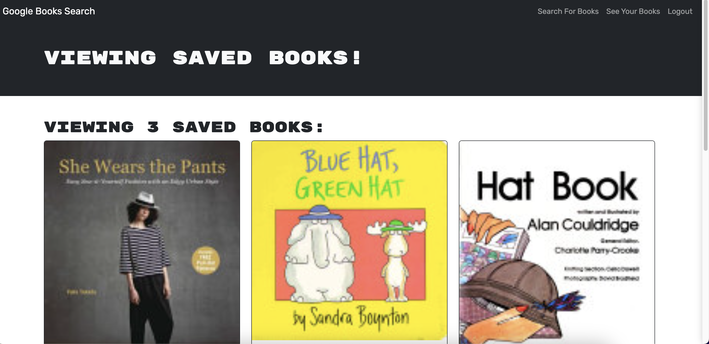

# Look for a Book

## Table of Contents (Optional)

- [Description](#description)
- [Installation(Optional)](#installation(optional))
- [Usage](#usage)
- [Credits](#credits)
- [License](#license)
- [How to Contribute](#how-to-contribute)

## Description

This project offers an intuitive book search engine that caters to avid readers looking to discover new books. The primary goal is to enable users to curate a personalized list of books for future purchases. Leveraging the Google Books API, this MERN stack application includes a React front end, a MongoDB database, and a Node.js/Express.js server and API.

## Installation(Optional)

1. Clone the repository to you local IDE.

2. Run ```npm install``` in your local IDE terminal to install the required dependencies.

3. Run ```npm run build``` to build the client.

4. Run ```npm run start``` to start the client/server.

## Usage

If you do not want to install to your local machine, check out the deployed application [here](https://look-for-a-book.onrender.com).




## Credits

Stater code [here](https://github.com/coding-boot-camp/cautious-meme).

Badges used can found [here](https://github.com/Ileriayo/markdown-badges)

## License


## Badges


## How to Contribute

Please contact me via my [Github](https://github.com/Kiararj) if you would like to contribute. 

